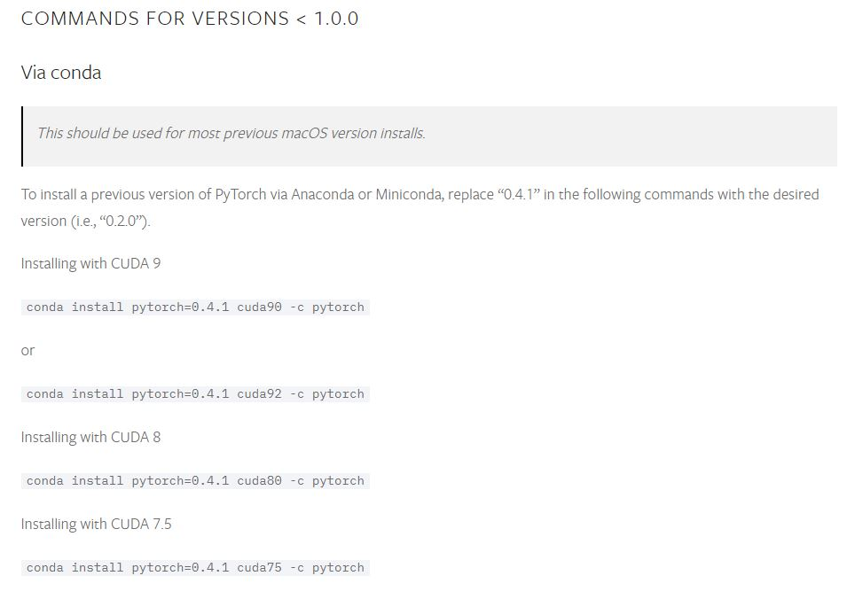
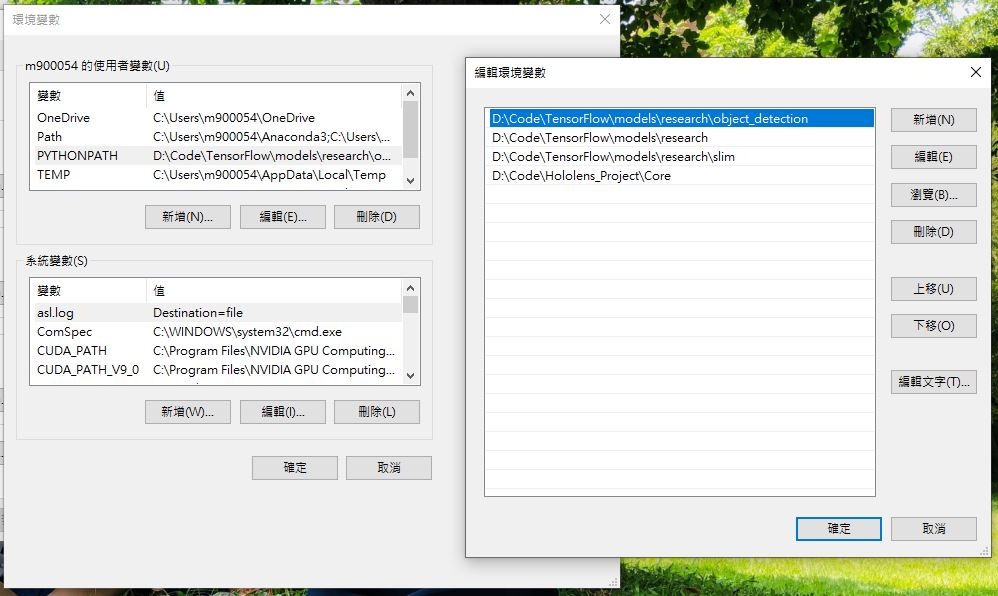

# TSN-Pytorch

[Origin-github](https://github.com/yjxiong/tsn-pytorch)

*Now in experimental release, suggestions welcome*.

**Note**: always use `git clone --recursive https://github.com/yjxiong/tsn-pytorch` to clone this project. 
Otherwise you will not be able to use the inception series CNN archs. 

This is a reimplementation of temporal segment networks (TSN) in PyTorch. All settings are kept identical to the original caffe implementation.

For optical flow extraction and video list generation, you still need to use the original [TSN codebase](https://github.com/yjxiong/temporal-segment-networks).

## Installation

### PyTorch 0.4.1



Our system CUDA version is 9.0, so the command line we used is ```conda install pytorch=0.4.1 cuda90 -c pytorch```

### torchvision 0.2.1
```pip install torchvision==0.2.1```

## Environment

- Python 3.6
- PyTorch 0.4.1
- torchvision 0.2.1

set PYTHONPATH：  


## Model(Weight)

[tsn_pytorch_resnet34](https://drive.google.com/drive/folders/11U1j7s2lO1tn2PxR40CGzIxBo9B9Xwpe?usp=sharing)

**please put \*.pth files in "Hololens_Project/Core/tsn_pytorch/pth"**

## Training

[tsn_train.py](tsn_train.py)

## Testing

[tsn_test.py](tsn_test.py)
