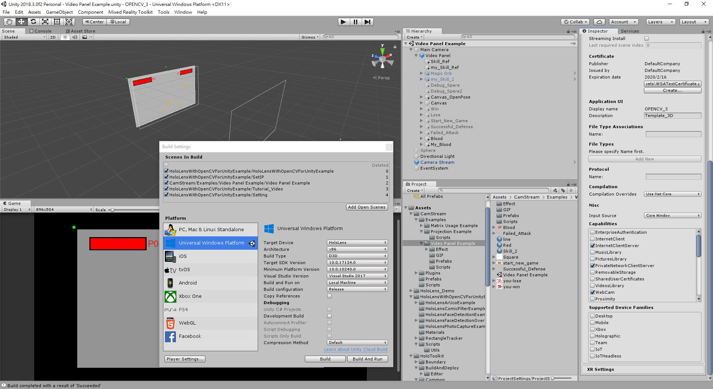
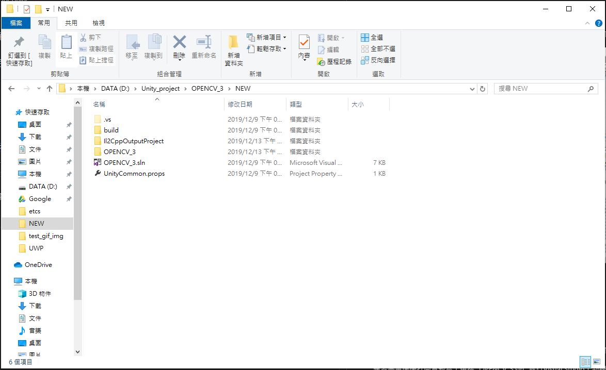
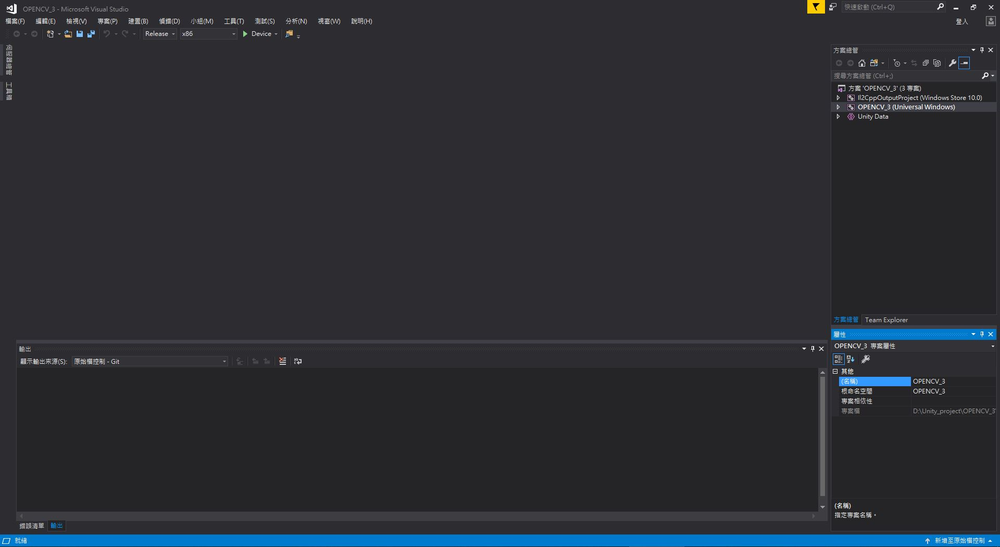
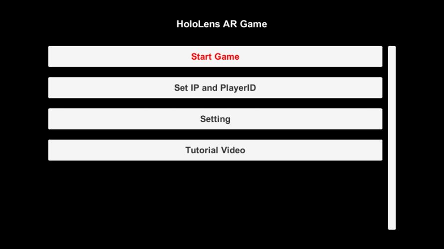
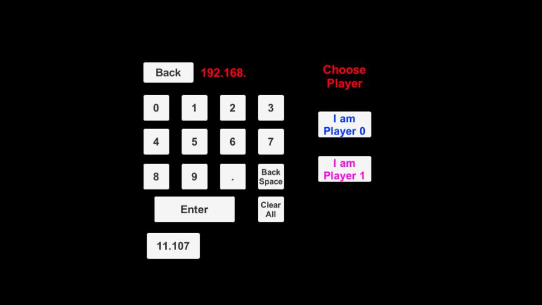
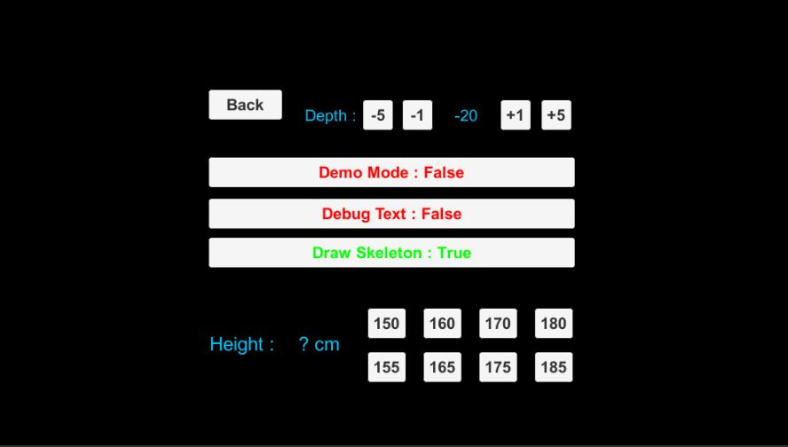

# HoloLens for Unity
## Setup

要從Unity編譯到HoloLens裡面，需進行兩段編譯。Unity編譯時的設定如下：

務必確認：
1. Scenes In Bulid
2. Build Settings
3. Player Settings 裡面的 Capabilities

此時在 "Scenes In Build" 裡面把這 5 個Scenes按照順序新增(要按照順序，右邊有index)，新增完之後右邊的Player Settings要需要調整一下，都設定好了之後按下 Build 開始建置，這個步驟可能需要花2分鐘左右，這部分就是第一段編譯。

建置完畢後後打開資料夾，選擇 ".sln" 執行Visual Studio，到裡面進行第二段編譯。

到Visual Studio裡面，上面哪一排設定要設定好，選擇Release x86，Device選擇HoloLens，我自己是透過USB讓HoloLens跟PC連接。

編譯完之後，HoloLens就會自動執行程式了，這就是第二段編譯，整個過程大概需要2分鐘，然後在這2分鐘的過程，不能讓HoloLens睡眠，螢幕須一直亮著，否則會error。

到這邊HoloLens端的程式已經建立完成。若[Server1](../Server1/README.md)的環境也都建立好，就可以開始遊戲。

Note : Server1.py 需要先在PC上運行，也只需要運行一次(一直開著)，HoloLens可隨時開啟遊戲與PC串接。

## Start Game

開始遊戲畫面會有4個選項：

需要先設定好 IP 跟 PlayerID，否則無法進入遊戲。

這邊的IP請輸入內網IP，輸入完畢後右側需要選擇 Plyaer 0 或是 Player 1。IP 跟 PlayerID 都設定完成後即可按下 Back 回到 Menu。

接著是更多額外設定的部分，如果沒有特殊需求也可以不用進行設定。

在 Setting 裡面，最上排 Depth 可調整骨架顯示面板的深度，如果發現骨架太靠近自己，可以增加 Depth 讓骨架顯示面板變深(遠離自己)。

Demo Mode 若為 False，代表非 Demo 模式，也就是正常遊戲模式。如果調為 True，代表 Demo 模式，此時進入遊戲後就會發現，整個視線中間多了一塊 Panel，顯示著 HoloLens 前方相機拍攝到的畫面。

Debug Text 若為 False，代表遊戲中的畫面並不會有任何 Debug 字樣，如果為 True，則會出現很多 Debug 文字訊息。

Draw Skeleton 若為 False，代表遊戲中不會畫出骨架，反之就會在遊戲中顯示對方的骨架。

最下面的身高選項，Default為175cm，***請注意這邊的身高為對方的身高***，如果對方身高與此高度差異過大，可以選擇適合的高度。