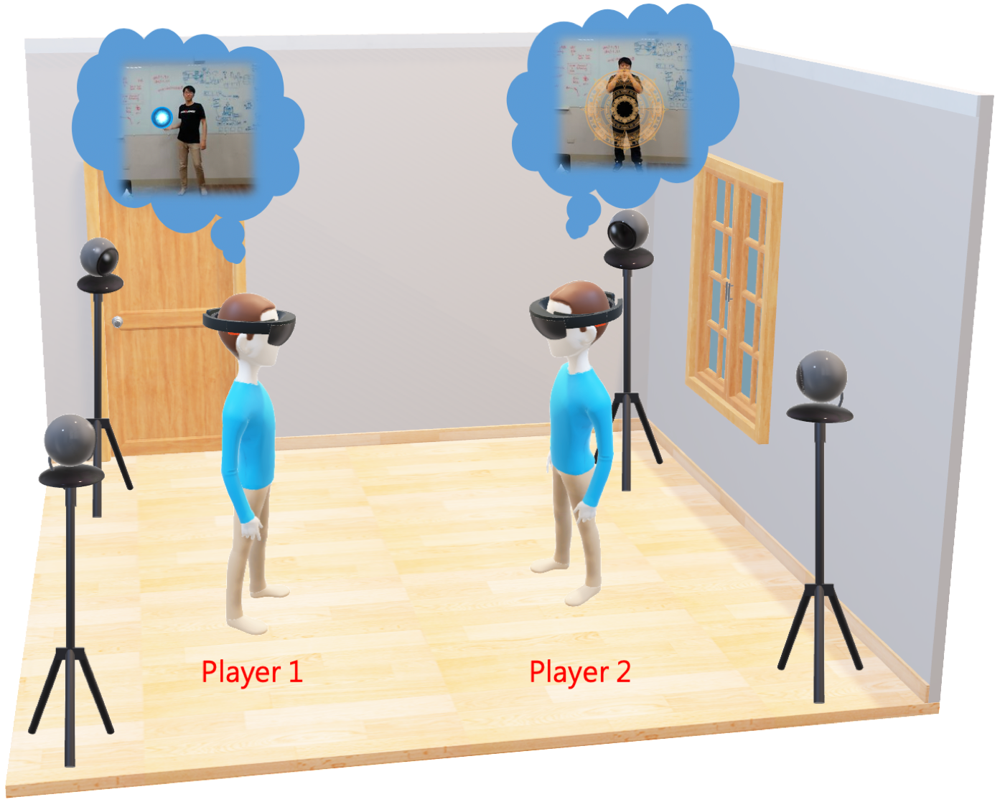
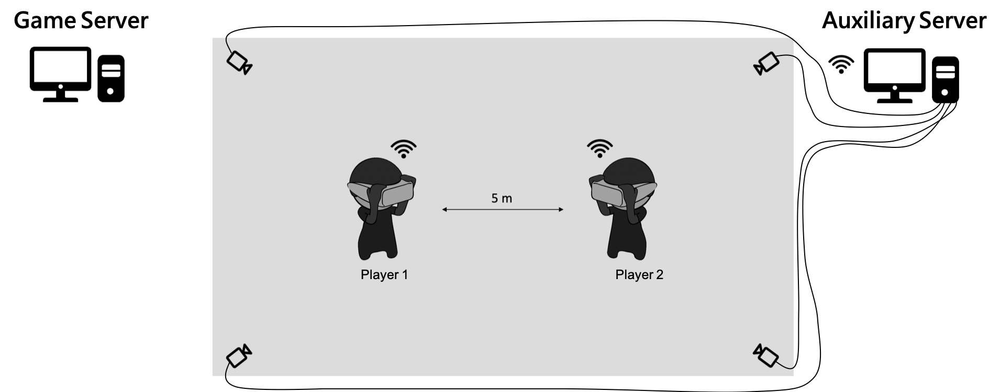
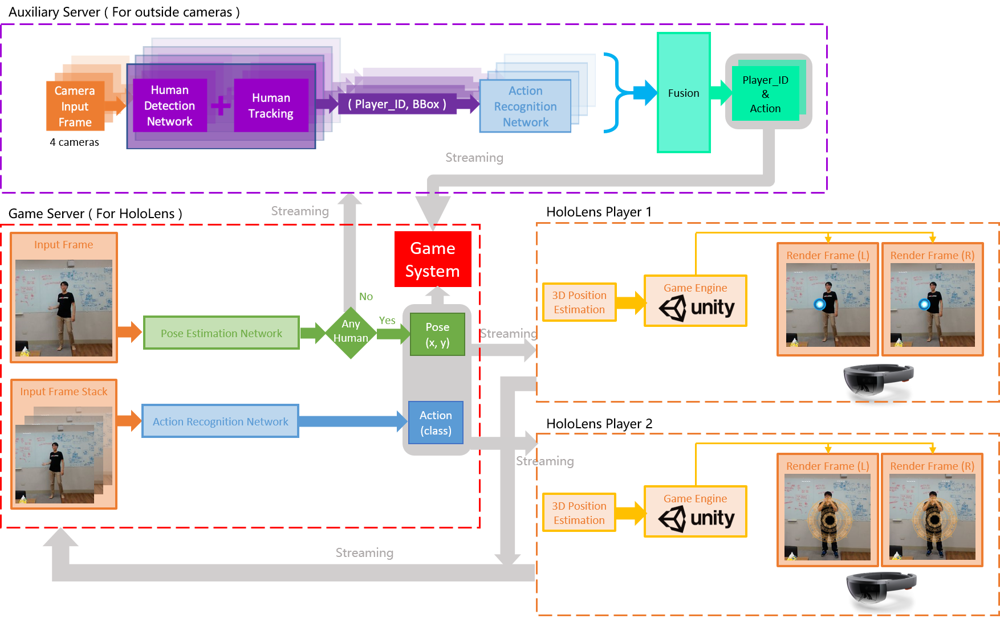
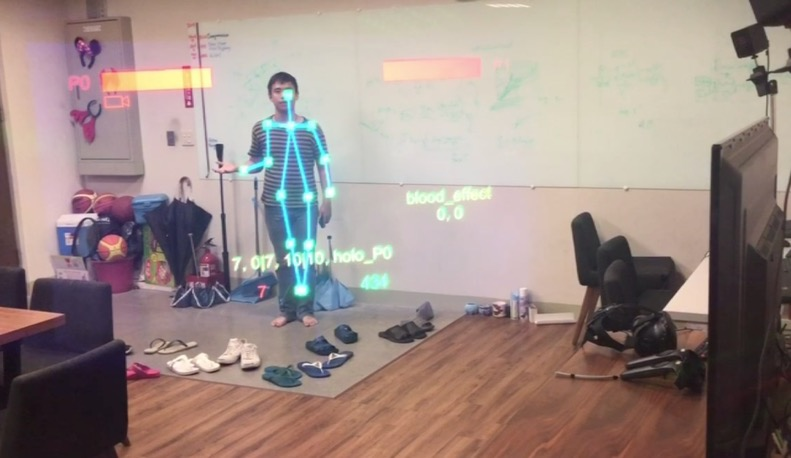
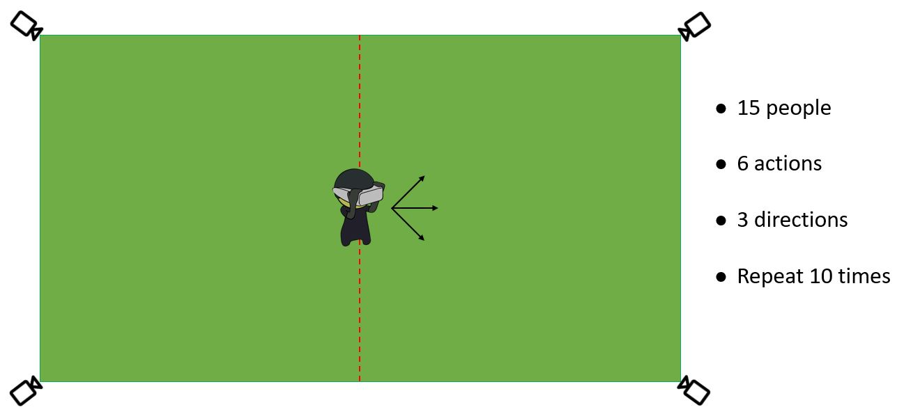
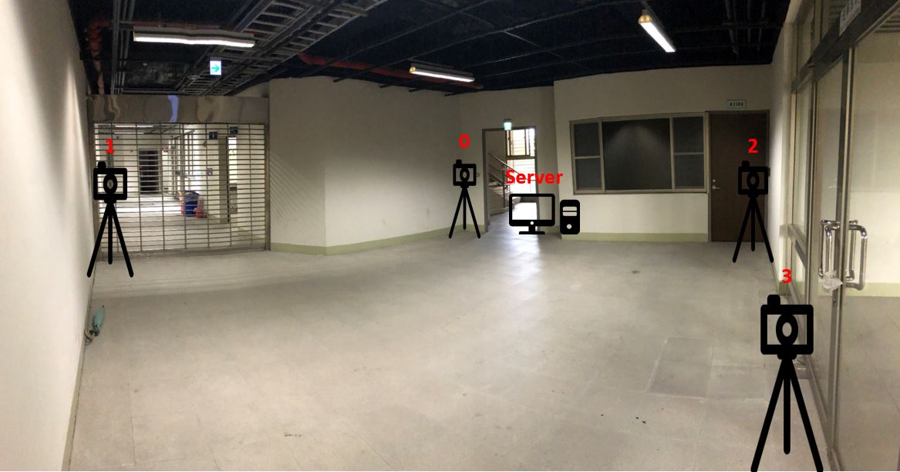
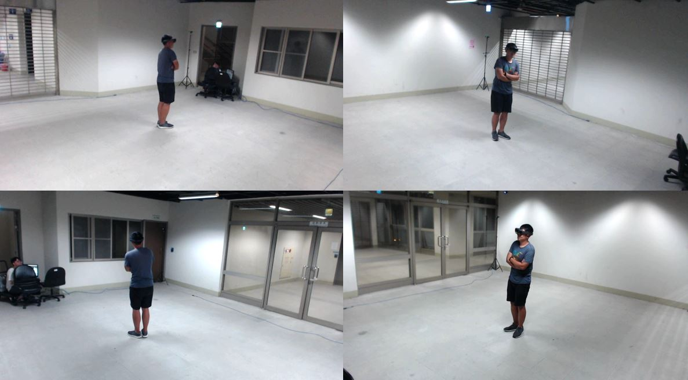
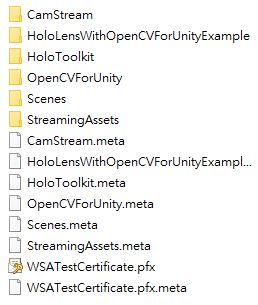

# Framework Design for Multiplayer Motion Sensing Game in Mixture Reality (HoloLens)

- 開發時間：2018/09/20 ~ 2020/01/20
- 開發平台：Win 10, GTX 1060, i7-7700k
- 開發裝置：Microsoft Hololens 1
- 開發工具：Python 3.6, Unity 2018.3.0f
- 開發環境：CUDA 9.0, cuDNN 7.1
- 技術：TensorFlow 1.9.0 (pose-estimation, human-detection, human-tracking), PyTorch 0.4.1 (action-recognition)

***

## Demo Video

[DEMO VIDEO](https://youtu.be/nWGuf3UnUHA)

[DEMO VIDEO for 2D panel effect](https://youtu.be/GcDtDXDkWOw)

[DEMO VIDEO for 3D rendering effect](https://youtu.be/jx-tkRXsz-I)

***

## Abstract

Mixed reality (MR) is getting popular, but its application in entertainment is still limited due to the lack of intuitive and various interactions between the user and other players. In this demonstration, we propose an MR multiplayer game framework, which allows the player to interact directly with other players through intuitive body postures/actions. Moreover, a body depth approximation method is designed to decrease the complexity of virtual content rendering without affecting the immersive fidelity while playing the game. Our framework uses deep learning models to achieve motion sensing, and a multiplayer MR interaction game containing a variety of actions is designed to validate the feasibility of the proposed framework.

***

## FlowChart and Scenario

玩家穿戴 MR 眼鏡拍攝對手的肢體動作，透過wifi將影像傳送至運算伺服器，根據預訓練之深度類神經網路模型估測出對手的2D人體姿態與動作類別，根據目前做的動作類別，在定義好的骨架節點觸發相對應的特效，將觸發節點之位置與對應特效的資訊傳回AR眼鏡端，由眼鏡裝置繪製特效，產生虛實對應的AR效果。例如 "火影忍者" 當中許多 "忍術" 可以透過此方法把特效添加在真實人物上。

由於Server1接收到的frame是透過Hololens回傳的，所以當配戴Hololens的人，沒有看著對方的時候，Server1接收到的frame會是沒有人的影像。
此時就必須依靠外部的4台camera幫忙偵測對方(敵人)的動作是什麼，並把資訊回傳給Server1。  

***

***

***

***

### 例如螺旋丸：  

### 在Hololens眼鏡裡面就會看到這樣：  

***

## Our Dataset

### For Hololens

* 我們總共請了 10 個人來幫忙錄data。  
* 每個人做 6 個action(有一個是no action)。  
* 每個action重複 15 次。  
* 總共會有大約 1000 segments video  

#### 蒐集資料的地點，以及camera擺放位置：

在lab裡面，隨便找一面牆壁拍攝  

#### Dataset look like：(1 people, 6 actions)

### For 4 cameras

* 我們總共請了 15 個人來幫忙錄data。  
* 每個人做 6 個action(有一個是no action)。  
* 每個action要朝 3 種不同的方向(direction)做。  
* 每個action重複 10 次。  
* 總共會有大約 9000 segments video**  

#### 蒐集資料的地點，以及camera擺放位置：

#### Dataset look like：(1 people, 1 action, 1 direction, 4 camera)

***

## Training on our dataset

* Total：7,500 segments, include 150,000 images (we don't use all dataset)
  * Traing：5,000 segments
  * Testing：2,500 segments

### Result：

***

## Installation for Hololens Toolkit and Unity

[Installation for Hololens Toolkit and Unity](https://github.com/Microsoft/MixedRealityToolkit-Unity/blob/2017.4.3.0/GettingStarted.md)

Version：
- Win 10 SDK 10.0.17134.0
- Visual Studio 2017
- .NET 4.6

***

## Install Opencv with Hololens for Unity

[HoloLensWithOpenCVForUnityExample_v1.0.2](https://github.com/EnoxSoftware/HoloLensWithOpenCVForUnityExample/tree/v1.0.2)

- Windows 10 Pro 1809
- Windows 10 SDK 10.0.17134.0
- Visual Studio 2017
- Unity 2018.3.0f
- [HoloToolkit-Unity](https://github.com/Microsoft/MixedRealityToolkit-Unity/releases) 2017.4.3.0
- [OpenCV for Unity](https://assetstore.unity.com/packages/tools/integration/opencv-for-unity-21088?aid=1011l4ehR&utm_source=aff) 2.3.3
- [HoloLensCameraStream](https://github.com/VulcanTechnologies/HoloLensCameraStream)

在Client裡面的Assets資料夾內，若上述全部都裝完應該會長這樣：  

***

## Python package

- python 3.6.7
- opencv 3.4.2 (pip install opencv-python)
- tensorflow-gpu 1.8.0
- pytorch 0.4.1
- torchvision 0.2.1

***

## Pose Estimation Network

[OpenPose using Tensorflow](https://github.com/ildoonet/tf-pose-estimation)

***

## Action Recognition Network

[TSN using PyTorch](https://github.com/yjxiong/tsn-pytorch)

***

## Quick Start

如果是要搭建沒有 outside camera 的系統，總共需要有一台電腦 + 一台或是兩台HoloLens，PC端運行Server1.py，接著開啟HoloLnes內的程式進行連接。

Server1 Environment Setup : [Server1 Setup](Server1/README.md)

HoloLens APP Installation : [HoloLens Setup](Hololens_Unity/README.md)
